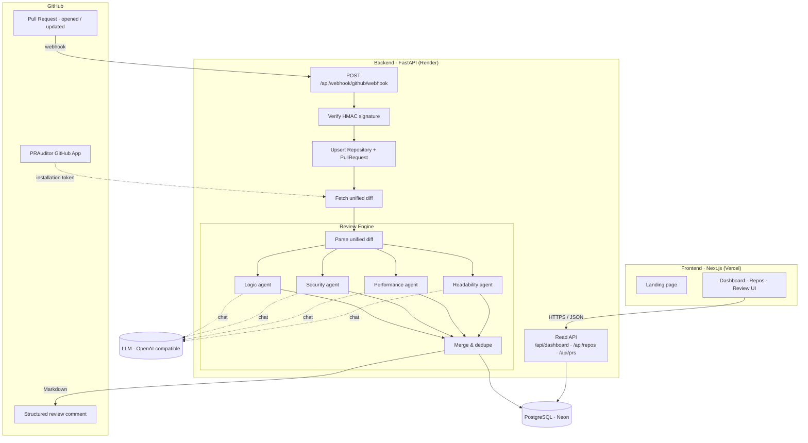

# Architecture

PRAuditor has three deployable pieces — a **Next.js frontend**, a **FastAPI
backend**, and a **PostgreSQL database** — plus a **GitHub App** that connects
it to your repositories and an **LLM** that powers the review.

## System diagram



## Components

### Frontend (`frontend/`)
Next.js 14 App Router. Strictly layered so pages stay thin:

```
page → feature view → hook (TanStack Query) → service → api-client (fetch)
```

- `services/` map 1:1 to backend endpoints; `lib/api-client.ts` is the only place that calls `fetch`.
- `components/landing/` is the public marketing page at `/`.
- The app (dashboard, repos, review UI) lives under the `(app)` route group with a shared shell at `/dashboard`, `/repos`, `/prs/[id]`.

### Backend (`backend/`)
FastAPI, split into routers under `backend/api/`:

| Router | Prefix | Responsibility |
|--------|--------|----------------|
| `webhook.py` | `/api/webhook` | Receive + process GitHub PR events |
| `repo.py` | `/api/repos` | List repositories, list PRs, repo summary |
| `pull_request.py` | `/api/prs` | Issues, PR summary, diff, rerun |
| `dashboard.py` | `/api` | Aggregate counts for the dashboard |

### Review Engine (`review_pipeline.py`, `agents.py`)
`run_review(diff)`:
1. `parse_unified_diff` splits the diff into per-file chunks.
2. Four agents run over the chunks — **logic**, **readability**, **performance**, **security** — each sending a role-specific prompt to the LLM (`llm_client.chat`) and parsing a JSON array of issues.
3. `_merge_similar` dedupes findings by `(file, line, kind, message)` and keeps the highest severity.

Each issue has: `file_path`, `line`, `kind`, `severity` (`info | minor | major | critical`), `message`, and an optional `suggestion`.

### GitHub App auth (`github_app_auth.py`, `github_client.py`)
- `generate_jwt()` signs a short-lived RS256 JWT with the App private key (PyJWT).
- `get_installation_token()` exchanges that JWT for an **installation access token**.
- The token is used to `fetch_pr_diff()` and `post_pr_comment()` via the GitHub REST API.

### Data model (`models.py`)
```
Repository (id, full_name, installation_id)
   └── PullRequest (id, repo_id, pr_number, title, state, head_sha, last_reviewed_at)
          └── ReviewIssue (id, pr_id, file_path, line, kind, severity, message, suggestion, created_at)
```
Schema changes are managed with **Alembic** (`alembic/versions/`).

## How a review flows (step by step)

1. **Trigger.** A PR is opened/reopened/synchronized on an installed repo. GitHub POSTs to `/api/webhook/github/webhook`. (Or a user calls `POST /api/prs/{id}/rerun`.)
2. **Verify.** The backend checks the `X-Hub-Signature-256` HMAC against `GITHUB_WEBHOOK_SECRET`. Invalid → `401`.
3. **Persist metadata.** The repository and pull request are upserted.
4. **Fetch diff.** Using an installation token, the backend downloads the PR's unified diff.
5. **Review.** The Review Engine parses the diff and runs the four agents against the LLM, then merges the results.
6. **Store.** Existing issues for the PR are replaced with the new set in PostgreSQL, and `last_reviewed_at` is updated.
7. **Comment.** Findings are rendered to Markdown and posted back to the PR as a review comment.
8. **Display.** The frontend reads the stored data via the JSON API to render the dashboard and per-PR review views.

## Trade-offs & notes

- **Synchronous webhook.** Review currently runs inside the webhook request. GitHub enforces a ~10s webhook timeout, so a queue/background worker is the planned next step (see the roadmap).
- **Model-agnostic.** Any OpenAI-compatible endpoint works — swap `GPT_API_URL`/`GPT_MODEL` to change providers or self-host a model.
- **Public reachability.** GitHub webhooks require a public URL; use a tunnel locally and the deployed URL in production.
